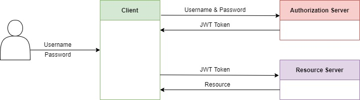

<!-- PROJECT LOGO -->
<br />
<div align="center">
  

<h3 align="center">Joke Of The Day</h3>

  <p align="center">
    
  </p>
</div>

<!-- ABOUT THE PROJECT -->
## About The Project
This repo contains the Frontend (written in Angular) and the backend (written in C#)
with the db scripts included.

Essentially it is an app where you can get a joke for the day.  
The reason for an app like this is to be able to say:

_“I need a good laugh, let me look at some good jokes!”_

```
App Features: 
* Admins can add jokes to the database.
* Get a daily joke on the main screen.
* Be able to login in as a user where you can get access to more than one joke a day.
```

### Built With

* [.Net Core](https://docs.microsoft.com/en-us/aspnet/core/?view=aspnetcore-6.0)
* [MySQL](https://www.mysql.com/)
* [Secrets Manager](https://docs.microsoft.com/en-us/aspnet/core/security/app-secrets?view=aspnetcore-6.0&tabs=windows)
* [AWS Cognito](https://aws.amazon.com/cognito/)
* [oAuth 2.0](https://docs.microsoft.com/en-us/azure/active-directory/develop/v2-oauth2-auth-code-flow)
* [MariaDB](https://mariadb.com/kb/en/documentation/)

### Cloud Instance

* [AWS](https://bbd-internal-sso.awsapps.com/start#)

 <!-- API ENDPOINTS-->
 ### API Endpoints
 ```
 */api/v1/validate
 */api/v1/session
 */health
 */api/v1/jokes/daily
 */api/v1/jokes/
 */login
 */logout
 ```

 ### Authentication Diagram
  

<!-- FRONTEND -->
# Frontend
The frontend setup for local building and running requires Anguler CLI to be installed.

Install globally using

```
npm install -g @angular/cli
```

To run a development server use `ng serve` command in the terminal when in the "\frontend\jokesapi" directory. Navigate to `http://localhost:4200/` to test the local development server.

The modules should install automatically.

## Website
The typical flow of the webpages are:

Home -> Login (cognito) -> Dashboard
Logout (cognito) -> Loggedout -> Home
404 -> Home

The daily joke is displayed on the Home page. When logged in, a random joke can be gotten through button press or the joke of the day can be retrieved again. 
When logged in as an administrator a new joke can be added in the text box.

 <!-- BACKEND -->
 # Backend
The backend setup for local building and running requires C# to be installed. The easiest way to run the backend is through Visual Studio. To open the backend in Visual Studio simple clone the git repository to your local machine and cd into the JokeOfTheDay folder, double click on the JokeOfTheDay.csproj and it will open in Visual Studio. From there the application can be run, which will automatically open a localhost webpage with swagger on. The endpoints can then be interacted with through swagger. 

## How the backend was setup

 <!-- AWS Secrets Manager DESCRIPTION -->
## How the authentication works:
 AWS Secrets Manager was used to store private creditentials such as database username and password. The backend which was implented in C# then connected to AWS Secrets Manager using a caching module in order to obtain the creditentials that were needed.

 <!-- AUTH DESCRIPTION -->
## How the authentication works:
JSON web token (JWT) was used to authenticate the users personal information in this program. JWT allows transmitting of data between parties as a JSON object in a secure and compact way. When a user wants to login to the web API they will provide a username and password which will be sent to an authorization server (AWS Cognito). If the username and password is correct a JWT token will be returned which the user can then send to the resource server (API backend), which will then provide the user with the resource they are looking for. However, if the username and password is incorrect the client will be unauthorised to view the resource they are wanting to review. 

<!-- GETTING STARTED -->
## Getting Started

If you wish to test out the code and run the DB instance, please follow the instructions below

### Prerequisites

* Cloud Formation Stack Endpoint

  _If you wish to run on a cloud service_
  
  _e.g. [AWS](https://bbd-internal-sso.awsapps.com/start#)_

* Application To Run Endpoint
  - Visual Studio or,
  - Command line on Windows.

* Node.js which includes Node Package Manager.
* C# ASP.NET Core 6.0

### Running the Application:
...

<!-- MEET THE TEAM -->
## Development Team

- [ ] [Conrad Vos](https://github.com/ConradBBD)
- [ ] [Mpho Futjane](https://github.com/Mpho-BBD)
- [ ] [Nikita Smal](https://github.com/nikitasmal)
- [ ] [Phumlani Ntini](https://github.com/2280727)
- [ ] [Pieter Kok](https://github.com/pieter-c-kok)
- [ ] [Wessel Scholtz](https://github.com/WesselBBD)

<!-- REFERENCES -->
## References

* [The Hive](https://the-hive.bbd.co.za/)
* [Pluralsight](https://app.pluralsight.com/)
* [C# documentation](https://docs.microsoft.com/en-us/dotnet/csharp/)
* [AWS documentation](https://docs.aws.amazon.com/)
